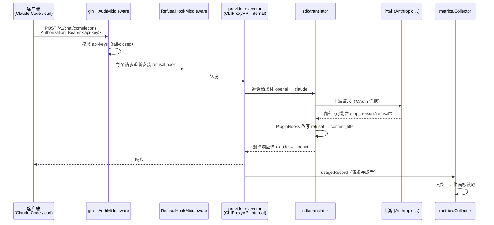

# slimproxy 架构剖析

写给要修改这个项目的人——可能是几个月后的你自己。目标不是罗列有哪些文件，
而是说清楚**每个决定是在什么约束下做出的**，以及**哪些地方改了会出事**。

---

## 1. 这是什么，不是什么

slimproxy 是一个跑在本机的 AI API 反向代理。客户端用 OpenAI 的协议发请求，
它翻译成 Claude 的协议转发到上游，用的是**订阅制 OAuth 凭据**而不是按量计费的 API key。

它建立在 [CLIProxyAPI](https://github.com/router-for-me/CLIProxyAPI) 的公开 SDK 之上。

**"slim" 指的是配置面和运行面，不是依赖树，也不是二进制体积。**

| | 上游 CLIProxyAPI | slimproxy |
|---|---|---|
| 配置项 | ~200 | 12 |
| 管理 API | 有 | 关 |
| 控制面板 | 有 | 关 |
| 插件宿主（dlopen） | 有 | 关 |
| pprof / Redis 用量队列 | 有 | 关 |
| 未知配置键 | 静默忽略 | **拒绝启动**并指名 |
| 入站认证 | fail-open | **fail-closed** |

依赖树**没有**变小，而且不可能变小。原因见下一节。

---

## 2. 与 CLIProxyAPI 的边界

这是整个项目最重要的约束，几乎所有奇怪的设计都源于它。

承载「上游客户端仿真」的 provider executor 位于 CLIProxyAPI 的 `internal/` 目录下。
**Go 的 internal 包规则使得另一个 module 只能通过 `sdk/cliproxy.Builder` 触达它们。**

后果：

- 构建一个 `Service` 就会链入 gin、pion/webrtc、redis、lumberjack——无论这些子系统是否运行
- 想真正裁掉依赖，只能 fork CLIProxyAPI，代价是在仿真层上背永久的合并负担
- **仿真层完全按 CLIProxyAPI 出厂状态使用，本项目不修改、不扩展、不加固它**

```mermaid
graph TB
    subgraph slimproxy["slimproxy（本项目）"]
        CLI[cmd/slimproxy<br/>命令分发]
        TUI[tui/<br/>全屏面板]
        PROXY[proxy/<br/>配置收窄 + 加固]
        TRANS[translate/<br/>类型化门面]
        TUNNEL[tunnel/]
        CRED[credentials/]
        DIAG[diag/]
        METRICS[metrics/]
    end

    subgraph sdk["CLIProxyAPI · sdk/（公开）"]
        BUILDER[cliproxy.Builder]
        AUTH[sdk/auth]
        TRANSLATOR[sdk/translator]
        USAGE[sdk/cliproxy/usage]
    end

    subgraph internal["CLIProxyAPI · internal/（不可直达）"]
        EXEC[provider executors<br/>上游客户端仿真]
        SERVER[api/server<br/>gin 路由与中间件]
    end

    CLI --> PROXY
    CLI --> TUI
    CLI --> TUNNEL
    CLI --> CRED
    CLI --> DIAG
    PROXY --> BUILDER
    PROXY --> METRICS
    TRANS --> TRANSLATOR
    CRED --> AUTH
    BUILDER -.->|唯一通路| EXEC
    BUILDER -.-> SERVER
    METRICS --> USAGE

    style internal fill:#3a2a2a,stroke:#8a5a5a
    style slimproxy fill:#1a2a1a,stroke:#5a8a5a
```



**上游依赖是已发布版本**：`go.mod` 直接依赖 module proxy 上的
`github.com/router-for-me/CLIProxyAPI/v7`（版本见 go.mod 与 `slimproxy version`
输出）。任何关于 SDK 行为的判断都以该版本的源码为准——升级上游版本时，
本文档里对上游内部行为的描述（executor、translator registry、watcher）需要重新核实。

---

## 3. 一个请求的一生



几个必须知道的时序细节：

- **`usage.Record` 在请求结束时才发布。** 因此进行中的流式请求在 SDK 的 usage 接口里
  是不可观测的。面板显示的是「最近完成的请求」，永远不是「正在进行的」。
  `metrics.Sample` 的注释写死了这一点。
- **样本不按时间顺序到达。** `RequestedAt` 是请求**开始**的时刻，记录却在**结束**时发布。
  一个 T+0 开始 T+60 结束的流，会排在 T+30 开始 T+31 结束的短请求之后。
  所以 `metrics.Collector.prune` 用过滤而不是切前缀，`Snapshot` 显式排序。
- **refusal hook 必须每请求重装。** `builder.Build` 内部无条件创建 `pluginHost`
  （`if pluginHost == nil { pluginHost = pluginhost.New() }`），会覆盖运行期的注册。
  所以 `proxy/refusal.go` 做成 gin 中间件，在每个请求上重新 `SetPluginHooks`。

---

## 4. 包职责

| 包 | 职责 | 可以独立使用吗 |
|---|---|---|
| `translate/` | 对 `sdk/translator` 的类型化 fail-loud 门面。**但它不在服务路径上**——见下 | 可以，14 个间接依赖 |
| `proxy/` | 把 12 项配置映射成 CLIProxyAPI 配置，pin 死所有不用的子系统，装配 Service | 否 |
| `metrics/` | 累积已完成请求的遥测，供同进程的面板读取 | 可以 |
| `credentials/` | 凭据池的读取、分类、删除；登录委托给 `sdk/auth` | 可以 |
| `tunnel/` | cloudflared 子进程的三态状态、启动、停止、PID 记录 | 可以 |
| `diag/` | 部署诊断。**结论不明时返回 Unknown，绝不降级为 Pass** | 可以 |
| `tui/` | 全屏面板。**只做呈现**，一切数据与动作通过 `Deps` 注入 | 需要 Deps |
| `fsperm/` | 把敏感路径收紧到当前用户。Windows 上的权限位不是权限 | 可以 |
| `journal/` | 结构化事件流：一行一个请求或状态变化，落盘、轮转、可查询 | 可以 |
| `cmd/slimproxy` | 命令分发与接线 | — |

分层原则：**动作层与展示层分离，不允许两套实现。**
面板的斜杠命令和 CLI 子命令调用的是同一批函数；两边只有排版不同。
判断（例如「这个 remedy 该不该显示」）必须放在域层——`diag.Result.ShowRemedy()`
就是为此存在的，因为两个渲染器都要问同一个问题。

---

## 5. 进程模型

```mermaid
graph LR
    subgraph P["slimproxy 进程"]
        T[bubbletea 面板<br/>渲染 goroutine]
        S[CLIProxyAPI Service<br/>gin + executors]
        C[metrics.Collector]
        S -->|usage.Record| C
        C -->|Snapshot| T
    end
    CF[cloudflared<br/>独立子进程]
    T -.->|spawn / kill| CF
    CF -->|回源| S

    style P fill:#1a2a1a,stroke:#5a8a5a
```



- **面板与代理同进程。** 面板直接读内存里的 collector，没有 HTTP、没有 SSE、没有 IPC。
  这是删掉 Web 仪表盘换来的最大简化。
- **cloudflared 是 detached 子进程。** 面板退出后它继续运行——这是有意的：
  隧道的生命周期不该绑在一个终端窗口上。用 `tunnel down` 停止。
- **两者的生命周期绑在一个 context 上**（`cmd/slimproxy/dashboard.go` 的 `supervise`）：
  代理挂了 → 取消面板 → 还原终端 → 错误打到已可见的 stderr；
  面板退出 → 停止代理，并等它真的停下再返回。

### 终端归属：一个不能共存的约束

**alternate screen 是单一写入面。** 任何写到 stdout 的东西都会落进已渲染的帧里，
并且**一直留着**——bubbletea 只重绘 diff。

麻烦的是把 logrus 静音并不够。CLIProxyAPI 有两处裸 `fmt.Printf` 绕过所有 logger：

- `sdk/cliproxy/service.go` — `"API server started successfully on: ..."`（启动时无条件）
- `internal/api/server.go` — `"server clients and configuration updated: ..."`（每次 watcher 重载）

而 watcher 监听 auth 目录，凭据自动刷新每 15 分钟就会重写文件触发它。

所以面板模式做两件事：

1. `proxy.WithoutStdoutLogs()` — logrus 只写文件，不再 tee 到 stdout；gin 进 release 模式
2. `proxy.TakeStdout()` — **在 fd 层面**把 `os.Stdout` 换成 `logs/stray-stdout.log`，
   把真实终端交给 bubbletea（`tea.WithOutput`）

第二步是重定向而非丢弃：第三方的 stdout 输出仍然落在一个找得到的地方。

---

## 5.1 可观测性：两个采集点，一条时间线

`journal/` 存在的理由是：这个进程知道的一切要么是散文（应用日志），要么活不过重启
（`metrics.Collector` 的一小时窗口）。两者都回答不了「昨天下午那次为什么慢」。

**必须是两个采集点，合成一个会丢一半问题：**

| 采集点 | 看得到 | 看不到 |
|---|---|---|
| `usage.Record`（`metrics.Collector.Observe`） | token、TTFT、总时长、**上游配额头**、哪个凭据 | 被路由层拒绝的请求——它们从未到达 executor |
| gin 中间件（`proxy/access.go`） | 所有非 2xx，含扫描的 404、无 key 的 401、来源分类 | token、时延、配额 |

只用前者，会在一个被公网持续扫描的部署上报告完美的错误率；只用后者，会丢掉每一个
值得看的数字。

**三条设计约束：**

- **`Append` 永不阻塞。** 它跑在 usage 分发 goroutine 上，慢一点就拖住所有其他插件。
  队列满时**丢弃并计数**，`doctor` 的 `journal` 检查会报出来——静默停止记录的日志，
  比没有日志更糟：几周后那个空档看起来像「那段时间很太平」。
- **噪音分流而非丢弃。** 扫描流量不列出但**计数**。混进错误率会让指标失去意义，
  完全不记又回答不了「有多少东西在敲门」。
- **不含 body 和 header。** 那是 `requestlog` 的职责，带着属于它的警告。
  一份打算保留一周、随手翻看的日志里不能出现凭据。

`Cf-Connecting-Ip` 是来源分类的唯一依据——cloudflared 回源到 `127.0.0.1`，
所以在 `RemoteAddr` 眼里所有公网流量都是本机流量。那个头可伪造，
**但这里只用于给日志行分类，不做任何授权决策**。

## 6. 贯穿全局的不变量

这三条是这个项目的核心价值主张，改动时优先保护。

### 6.1 未知不是正常

`diag.Unknown` 是独立的等级，**不是 Pass 的一种**。而且它在
`Report.Worst()` 里的严重度**高于 Warn**：

```
Pass < Warn < Unknown < Fail
```

理由写在代码里：一个持有实时凭据的进程上，一个未解答的问题比一个已知良性的告警更值得注意。
超时、panic、被取消的检查全部归为 Unknown。

同一条原则在别处的体现：

- `tunnel.Status` 有 `ConnectionsKnown` 和 `ConnectionsErr`——「查不到」和「查到了是 0」
  是两个不同的状态，后者意味着公网正在 502
- `tunnel.State` 是四态而非布尔：`NotConfigured` / `Configured` / `Running` / `StateUnknown`
- 面板的 `metrics.Sample` 成功时显示 `ok` 而不是 `200`——进程从未观测到状态码

### 6.2 Usable 与 Recoverable 是两个问题

```go
// 现在能不能服务请求（展示用）
func (c Credential) Usable(now time.Time) bool

// 代理会不会加载它、刷新后可能服务（守卫用）
func (c Credential) Recoverable(now time.Time) bool
```

一个 access token 过期但 refresh token 完好的凭据：`Usable` 为 false，`Recoverable` 为 true。

**混用会造成真实的数据损失。** 历史上 `auth rm` 的「最后一个凭据」守卫误用了 `Usable`，
于是一个只有过期凭据的池被算作「零个可用」，守卫认为没什么可保护的，直接删光，退出码 0。

判断规则：问「删了会不会有损失」用 `Recoverable`；问「现在能不能干活」用 `Usable`。

### 6.3 入站认证 fail-closed

CLIProxyAPI 的 `AuthMiddleware` 在没有注册 access provider 时对每个请求调 `c.Next()`。
空的 `api-keys` 因此不是「没配认证」，而是**「不强制认证」**——在一个持有订阅凭据的进程上。

`proxy.Config.Validate()` 拒绝这种配置，除非显式设置 `allow-unauthenticated: true`。
同时拒绝上游示例里的 placeholder key（那些值发布在公开仓库里）。

---

## 7. 对 SDK 行为的假设

这个项目大量依赖对 CLIProxyAPI 内部行为的观察，注释里记录了每一条。
**升级 SDK 时这些是首先要重新核实的。**

| 假设 | 位置 | 不成立会怎样 |
|---|---|---|
| `Builder` 需要一个存在的配置文件路径，watcher 每次变更都重读它 | `proxy/materialize` | 热重载静默失效 |
| 零值 `Config` 不能往返（`credential-in-flight.snapshot-interval must be positive`） | `proxy/build` | 同上，且只记录日志不报错 |
| `MANAGEMENT_PASSWORD` 环境变量单独就能启用完整管理 API | `proxy/config.go` | 管理 API 被悄悄启用，含明文返回所有 provider key 的接口 |
| `GetTokenStore()` 惰性构造 FileTokenStore，`RegisterTokenStore` 在 sdk/ 下无调用者 | `proxy/config.go` | 迁移时设了 `PGSTORE_DSN` 会加载零个凭据 |
| `pluginHost` 被无条件创建，覆盖运行期注册 | `proxy/refusal.go` | refusal 改写失效，策略拒绝变成空响应 |
| `Service.Run` 无条件返回 `ctx.Err()` | `cmd/slimproxy/main.go` | 每次正常停止都以非零码退出 |
| 关机截止时间在**启动时**确定而非信号时 | `cmd/slimproxy/dashboard.go` | 长跑进程得不到优雅排空 |

---

## 8. 改这个项目时的陷阱

### 8.1 显示宽度不是字节数也不是 rune 数

面板的标签是中文，一个 CJK 字符占**两格**。用 `runewidth.StringWidth`，
不要用 `len()` 或 `utf8.RuneCountInString`。搞错的症状是右边框逐行漂移。

而且：**先按纯文本排版，最后才上色**。一旦字符串里有了 ANSI 转义序列，
逐 rune 截断会切断转义序列，把后面整屏喷成乱码。

### 8.2 面板显示的外来内容必须净化

模型名、路由名、主机名、账号、文件名、上游错误体——这些来自配置文件、
provider 响应、磁盘。它们不保证是干净的一行：

- `\n` 把一行劈成两行，下面每一行都错位
- `\t` 展开成不确定的格数，宽度算术看不见
- `\x1b` 开始一个转义序列，**会被终端执行**——`\x1b[2J` 直接清屏

`tui/theme.go` 的 `sanitize()` 在 `renderSegs` 这个单点做净化，替换成 `·` 而不是删除
（保持宽度，并且让替换可见）。

### 8.3 定时器链只能有一条

面板的轮询用「结果到达时排下一次」的模式。但结果消息**不只来自定时器**——
手动刷新（`r` 键）和命令的 `RefreshTunnel`/`RefreshCreds` 走的是同一条 fetch 路径。

所以消息带 `renew` 标志，只有 tick 发起的 fetch 才续链。
漏掉这个的后果是每次刷新永久多一条自维持的轮询链——按三次 `r`，
隧道轮询就从每 45 秒一次变成七次。

### 8.4 Windows 上的权限位不是权限

`os.WriteFile(path, body, 0o600)` 在 Windows 上只设置只读属性，**ACL 完全继承父目录**。
实测过：`auths/`、`logs/`、`slimproxy.*.effective.yaml` 都带着一条继承的 ACE，
把 OAuth refresh token 和入站 API key 交给了本机的另一个组。

所有敏感路径必须过 `fsperm.Restrict()`，它设一个只含当前用户的 DACL 并**关闭继承**
（`PROTECTED_DACL_SECURITY_INFORMATION` 才是关键的那一半——只加一条 ACE 不会移除继承的）。
新增会落盘凭据、日志或配置的路径时，记得加上。

### 8.5 `translate/` 不在服务路径上

这个包是对 `sdk/translator` 的 fail-loud 门面，但**真正翻译请求的不是它**——
CLIProxyAPI 的 executor 直接调 `sdktranslator`，完全绕过。
grep 全仓库：服务路径上只有 `proxy/proxy.go` 的 `_` 空导入（为了触发 builtin 的 init），
以及 `routes` 命令的 `Registered()`。

所以「未注册的协议对会把未翻译的报文转发上游」这个风险**依然完整存在**，
`translate` 只是让读代码的人以为它被防住了。

真正防住它的是 `proxy/untranslated.go`，位置很巧：registry **只在没有内置 transformer 时**
才咨询 `TranslateRequest`/`TranslateResponse` 这两个 hook——所以被调用本身就是信号。
不需要预测哪些组合会被用到，也不需要一个可能两头错的启动期断言。
`from == to` 排除在外（同方言不需要翻译，claude→claude 确实会走到这里）。

观察结果通过 `proxy.UntranslatedPairs()` 暴露给 `doctor` 的 `translator` 检查。
注意从**另一个进程**跑 `doctor` 时这一项是 `UNKNOWN` 而不是 `PASS`——
外部进程无从观察，报 PASS 就是给出一个它没有得出的结论。

### 8.6 排版可以各写各的，判断不行

面板和 CLI 都渲染诊断报告、凭据列表、隧道状态。排版不同是合理的（终端宽度不同、
面板要滚动）。但**判断必须共享**，否则会漂移：

- `diag.Result.ShowRemedy()` — 通过的检查不该显示补救建议
- `diag.Result.ExtraErr()` — Detail 已含该错误时不要重复
- `diag.LevelsBySeverity()` — 严重度顺序只有一个定义

这三个函数存在的唯一理由，就是曾经有两份实现并且已经不一致了。

---

## 9. 测试策略

### 变异测试是必须的，不是可选的

**「测试通过」不等于「测试有效」。** 这个项目在阶段二发现三个断言恒真——
它们在真实 bug 下照样绿。此后每一批测试都做变异验证：手工注入一个 bug，
确认对应的断言变红。

做法（用 `git stash` 或备份文件都行，关键是改完能干净还原）：

```bash
cp target.go target.go.bak
sed -i 's/正确的判断/错误的判断/' target.go
go test ./pkg/ -timeout 90s -run TestThatShouldCatchIt   # 必须 FAIL
cp target.go.bak target.go && rm target.go.bak
```

两个教训：

1. **给 `go test` 加 `-timeout`。** 有一次变异让测试死锁，跑满了 10 分钟默认超时，
   而且脚本被中断后**文件留在变异状态**。测试里等 context 的 goroutine 要有超时逃生口。
2. **变异存活时先怀疑测试，别急着改代码。** 多次出现的「变异仍然通过」，
   查下来都是测试设计问题（目标测试选错、变异表达式在赋值前求值、断言对象无法区分两种实现）。
   也有一次是好消息：修复把两处算术合并成了共享函数，于是变异同时改变两侧、
   仍然一致——**结构性修复让整个 bug 类别消失了**。

### 渲染出来看

面板的对齐、可读性、以及「警告有没有真的显示出来」，宽度断言证明不了。
`tui/preview_test.go` 和 `TestRenderPreview` 明确声明自己不是检查，就是打印帧给人看。
`headerRow` 读墙上时钟、退出警告被 running 标签遮住，都是这样发现的。

### 实测不可替代

测试环境和真实环境的差异是真实的 bug 来源：

- `confirm()` 靠「读到 EOF」判断非交互，`go test` 的 stdin 立即 EOF 所以全绿，
  真实终端里管道 stdin 挂了六分半
- `tunnel up` 的成功判据，实测才发现 cloudflared 遇到无效隧道 ID **不会退出，会无限重试**

---

## 10. 目录速查

```
cmd/slimproxy/     命令分发（cli.go）、各命令实现、面板接线（dashboard.go）
proxy/             配置收窄与加固、Service 装配、日志、请求日志、refusal 修补
translate/         sdk/translator 的类型化门面
tui/               全屏面板：theme(色板/宽度) data(依赖/轮询) command(注册表)
                   action(执行) model(状态机) view(渲染) run(TTY/入口)
tunnel/            cloudflared 子进程管理
credentials/       凭据池
diag/              部署诊断
metrics/           完成请求的遥测
docs/              本文档、使用指南、CLI 迁移计划
deploy/            隧道部署文档与 PowerShell 安装脚本
```
